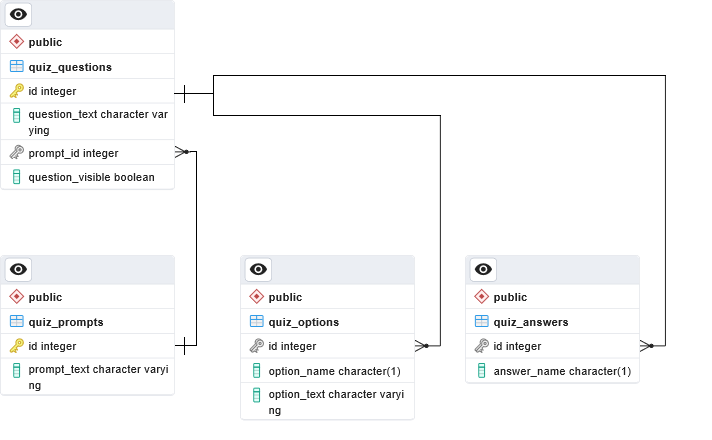

# Generate Quiz Using Open AI (C# Console App)

This is a console app that uses  **OpenAI API** to generate quizzes that has multiple choice options and also provides the correct answer for each question:

<ol><li>Connects to OpenAI API, sends request to generate a quiz with correct answers and return it in **JSON** format.</li>
<li>The JSON response is then parsed. If no valid response is given, the program will throw up an error message and halt execution.<br><em>(Note: Once in a while the JSON response given is not formmatted correctly thus causing error when parsing.)</em></li>
<li>Once the JSON has been parsed, the program will create the required tables, if it does not exist, to hold the data according the following ERD:</li>

<li>The program will now insert the data into the appropriate tables.</li>
</ol>

How to use this repo:
--------------------------
<ol><li> To clone this repo, use:<br> <code>git clone https://github.com/Fred-Khan/Generate_Quiz_Using-OpenAI_Console.git</code><br>
The command will create a folder called Generate-Quiz-Using-OpenAI_Console.<br>
</li><br>
<li>Change into this folder and run:</li>
<code>dotnet add package Newtonsoft.Json<br>
dotnet add package npgsql</code><br>
<br><li>It is also recommended that you run the following command while in the *Generate-Quiz-Using-OpenAI_Console* folder to create a **.gitignore** file:
<code>dotnet new gitignore</code><br>
 The .gitignore will ensure that unnecessary files as well as importantly, your user settings file which contains *username, password and API key* is not uploaded to GitHub!</li><br>
 <li> Open the file *Settings.example.txt*. Review and enter all required information.<br>
Then save the file as **Settings.user** without the the .txt extension<br>
When running the program, it reads the settings from Settings.user. This is so that you do not develop bad security habits and encode any sensitive information directly into the code blocks itself. *Note: We could also store all this information into a table in a database.*</li>
<br><li>The Target Framework is .Net7. If you have a different version installed, change the **TargetFramework** line in **generate-quiz-using-openai_console.csproj** file to the version you are using.</li>
<br><li> You should now be able to run the app with:
 <br><code>dotnet run</code>
 </ol><br>

Pseudo Code
---------------
>Program.cs

<code>
Start of Program<br>
    Set settingsFile = "Settings.user"

    Check if settingsFile does not exist
        Print an error message: "Please create Settings.user.txt file and enter all required information."
        Exit the program

    Read configuration parameters from settingsFile and store them in the settings dictionary
        Split each line in the file by '=' and create key-value pairs
        Convert the key-value pairs into a dictionary

    Check if any of the required values (APIKEY, USERNAME, PASSWORD) are empty in the settings dictionary
        Print an error message: "Please provide all required information in the Settings.user.txt file."
        Exit the program

    Call Openai.GenerateQuiz method with the APIKEY, APIURL, PROMPT, and MODEL values from the settings dictionary
        Store the returned generatedQuiz array in generatedQuiz variable

    Check if generatedQuiz is empty or the status code is not "OK"
        Print an error message: "A problem has occurred while generating or parsing the quiz response."
        Print the status code and generated quiz
        Exit the program

    Print the parsed JSON output from Open AI

    Create a connection string for NPGSQL using the HOST, USERNAME, PASSWORD, and DATABASE values from the settings dictionary

    Call Quiz.AddQuiz method with the generatedQuiz, connectionString, and generatedQuiz[2] values

End of Program
<br>
<br>

</code>

>Openai.cs
>This pseudo code represents the functionality of the `Openai` class and the `GenerateQuiz` method. It includes variable initialization, API request handling, response parsing, error handling, and returning the generated quiz array.

<code>

Class Openai<br>

    Function GenerateQuiz(apiKey, apiURL, prompt, model)<br>
    
        Initialize getQuizContent as null<br>
        
        Initialize responseStatusCode as null<br>
        
        Create AuthenticationHeaderValue with the API key and store it in headers<br>

        Create a data object with prompt, model, max_tokens, and temperature

        Serialize the data object to JSON and store it in the json variable
        Print the json string

        Create a new HttpClient

        Set the Authorization header of the HttpClient to the headers variable

        Send a POST request to the apiURL with the json data and store the response in the response variable

        Get the status code of the response and store it in responseStatusCode

        Check if the response is successful
            Read the response content as a string and store it in responseContent

            Try to deserialize the response content
                Deserialize the response content as a dynamic object and store it in result
                Print the status code

                Check if the generated quiz is present in the result
                    Get the generated quiz content and store it in getQuizContent
                Else
                    Print an error message: "Failed to generate the quiz. The response does not contain the expected/any quiz content."
            Catch any exception during deserialization
                Print an error message: "An error occurred during deserialization from OpenAI: {exception message}"
        Else
            Print an error message: "Failed to generate the quiz. Status code: {responseStatusCode}"

        Create an array with getQuizContent, responseStatusCode, and prompt and store it in generatedQuiz

        Return the generatedQuiz array
    End Function
End Class
</code>
<br>
<br>
> Quiz.cs
> This pseudo code represents the functionality of the `Quiz` class. It includes functions to add a quiz to the database and create the necessary tables if they do not exist. It handles JSON parsing, database connection, table creation, and data insertion.

<br>
<code>

Class Quiz<br>


    Function AddQuiz(getQuestionsJSON, prompt_Text, connectionString)
        Create the required tables if they do not exist

        Declare the document variable

        Try to parse the JSON string into a JsonDocument object
            Catch any JSON parsing exception and handle it

        Establish a connection to the database

        Open the database connection

        Check if the document is null before proceeding
            Print an error message and close the connection if the document is null

        Declare a variable to hold the prompt ID generated from inserting the prompt text

        Insert the prompt text into the quiz_prompts table and retrieve the generated ID
            Check if the prompt text is not null
                Set the parameter values and execute the command
                Retrieve the generated ID and store it in prompt_ID
                Print the generated prompt ID

        Iterate through each property in the JSON document and insert into tables
            Declare a variable to hold the question ID generated from inserting the question

            Insert the question into the quiz_questions table and retrieve the generated ID
                Get the question value from the JSON
                Check if the question value is not null
                    Set the parameter values and execute the command
                    Retrieve the generated ID and store it in question_ID
                    Print the generated question ID and question text

            Insert the options into the quiz_options table
                Get the value of the "Options" property from the JSON
                Iterate through the options and insert them into the options table
                    Set the parameter values and execute the command
                    Print the option name and option text

            Insert the answer into the quiz_answers table
                Get the value of the "Answer" property from the JSON
                Set the parameter values and execute the command
                Print the answer

        Close the database connection
    End Function

    Function CreateTablesIfNotExists(connectionString)
        Create a new NpgsqlConnection with the connection string
        Open the connection

        Create the quiz_prompts table if it does not exist
        Create the quiz_questions table if it does not exist
        Create the quiz_options table if it does not exist
        Create the quiz_answers table if it does not exist

        Close the connection
    End Function
End Class

</code>


Program flowchart
----------------
The main program.cs has an async Main() that will check for the existence of Settings.user file. 

```mermaid
graph LR
A[Program.cs] -- Read Settings from file --> B(Openai.GenerateQuiz)
B --Parse JSON Response-->C{Quiz.CreateTablesIfNotExists}
C --Format data for tables--> D(Quiz.AddQuiz)
D ----> A


